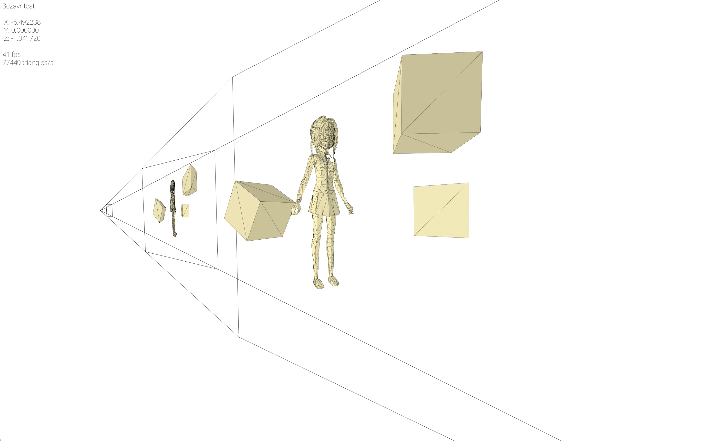
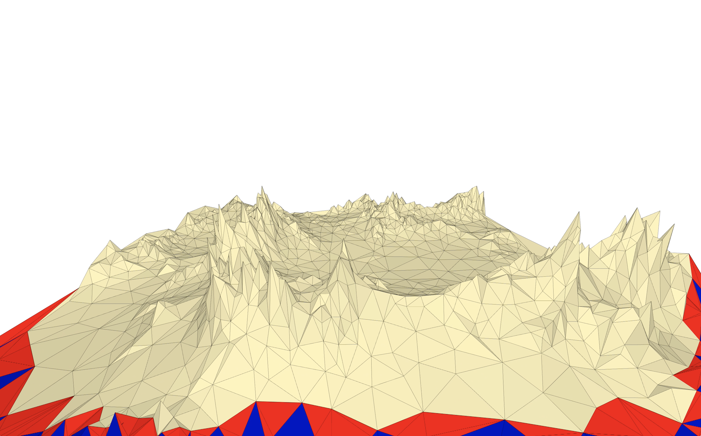
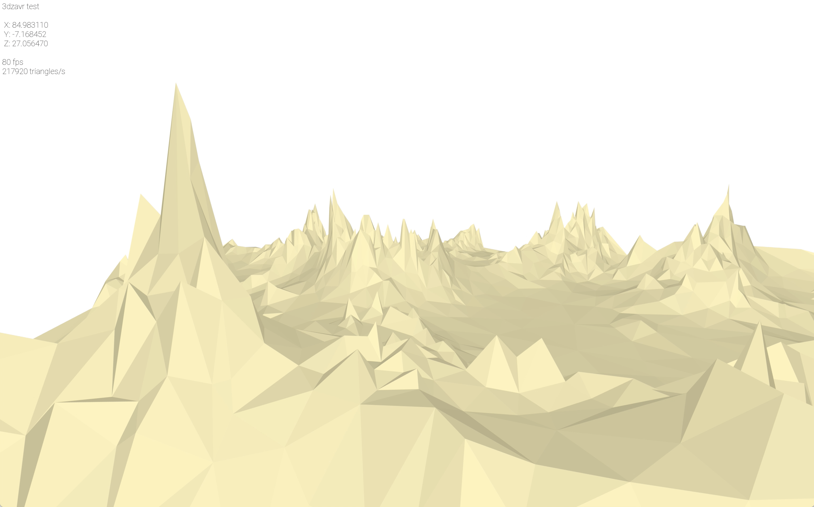
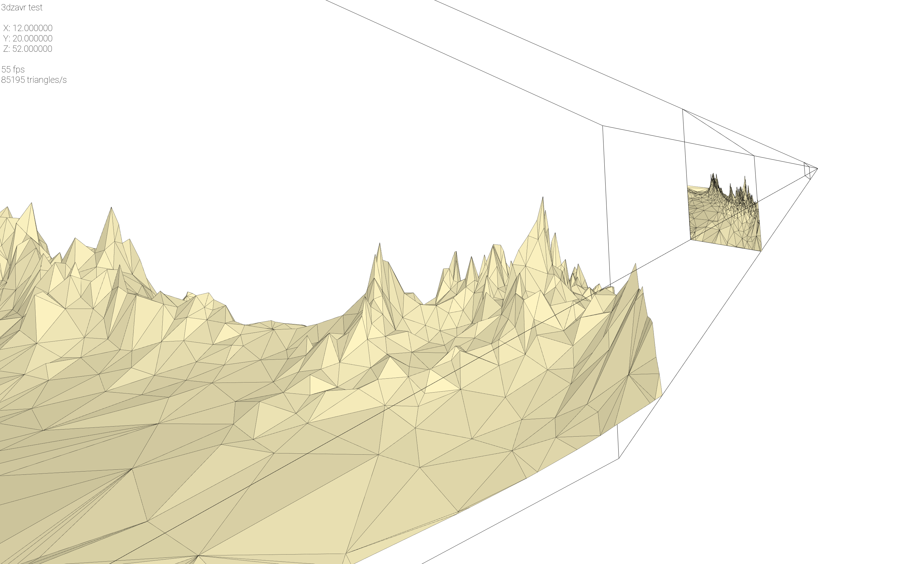
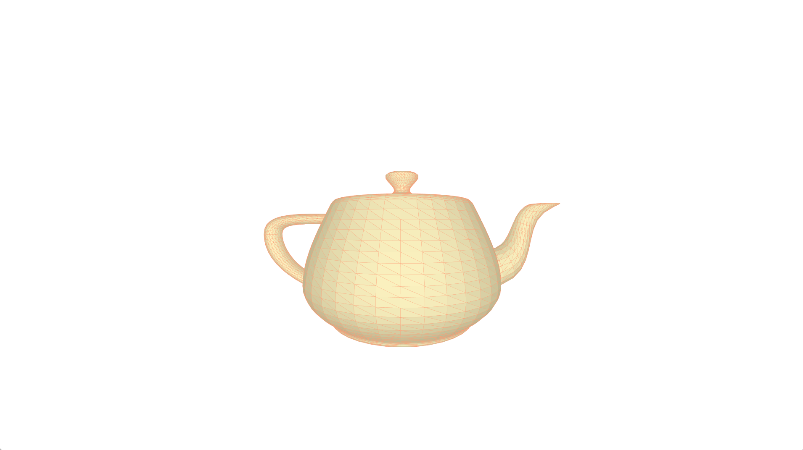
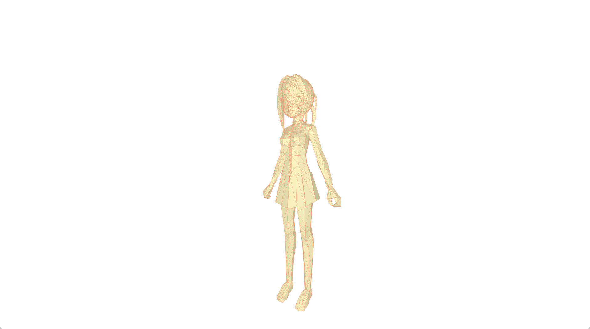

# 3dzavr
Simple 3d engine based on SFML library.
I try to make this engine powerful and easy to understand.

The main goal - to implement basic 3D graphics from scratch (without OpenGL or any other 3D graphics library)
For this moment I already implemented:
- Operations with Point4D, Matrix4x4, Triangles and Mesh. I used operators overloading to simplify coding.
- Projections from 3D on 2D plane, movement and rotation of camera and meshes.
- Triangles clipping
- Basic smooth animations for meshes
- External camera (You can see how 3D world projected on 2D plane and the procces pf clipping)
- You can render animated scene to .mp4 files or sequence of .png files (film/img/ & film/mp4). But it is extremely slow process due-to SFML waste a lot of time on saving .png files. It is still better to capture your screen by some additional program.

TODO:
- Animation of camera
- Improvement of animations by using Bézier curves
- Textures
- Solve external camera bug: projected 2D triangles should be drawed following their order (in camera system) and not Z component in external camera system.

Demonstration of how does this engine work:

