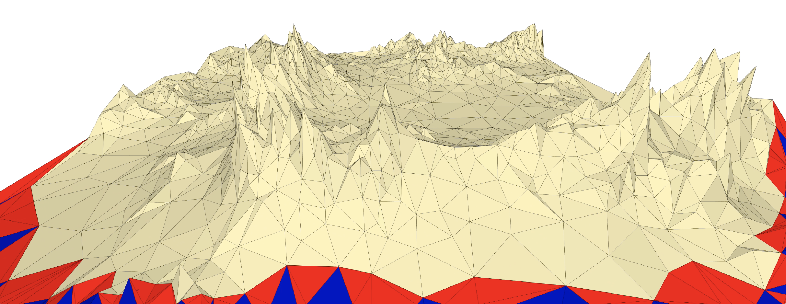

# 3dzavr

<h4>About:</h4>

Simple 3d engine based on SFML library.
I tried to make this engine powerful and easy to understand.

The main goal - to implement basic 3D graphics from scratch (without OpenGL or any other 3D graphics library)

For this moment I already implemented:
- Operations with Point4D, Matrix4x4, Triangles and Mesh. I used operators overloading to simplify coding.
- Projections from 3D on 2D plane, movement and rotation of camera and meshes.
- Triangles clipping
- Advanced smooth animations by using Bézier curves for meshes and camera
- External camera (You can see how 3D world projected on 2D plane and the process of clipping)
- You can render animated scene to .mp4 files or sequence of .png files (film/img/ & film/mp4). But it is extremely slow process due-to SFML waste a lot of time on saving .png files. It is still better to capture your screen by some additional software.
- Physics engine
- Network system

<h4>Installation:</h4>

1) Download and install OpenAL library for SFML sound support (in current version you can't setup this engine without OpenAL)
   
    openal: https://openal.org/downloads/
   

2) Install SFML on your computer (<b>The compiler versions have to match 100%</b>):
   
    sfml: https://www.sfml-dev.org/download.php
   

2) Open CLion or Visual Studio
   
   CLion (recommended): https://www.jetbrains.com/clion/
   
   Visual Studio: https://visualstudio.microsoft.com/ru/
   

3) Clone this repository
   
    rep url: https://github.com/vectozavr/3dzavr
   

4) Built project

For any issues, please, create new issue in this repository.

Demonstration of how does this engine work:

